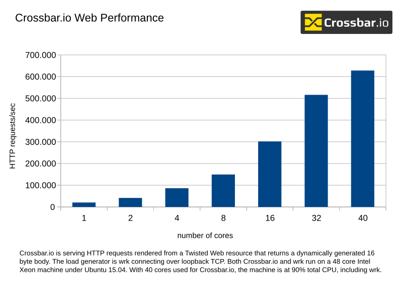
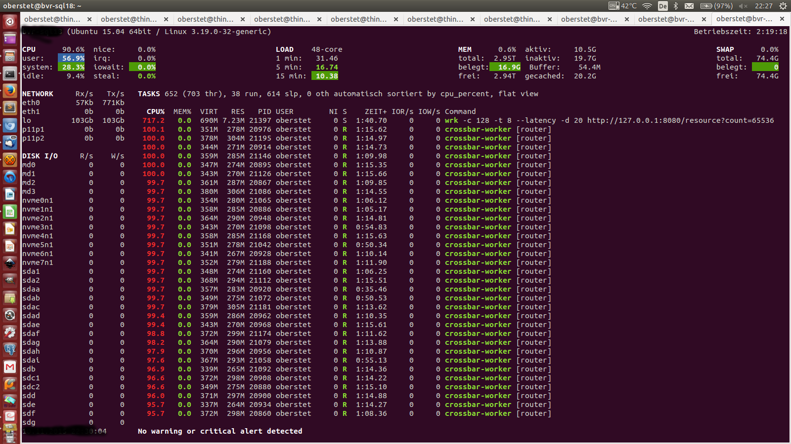

# Scaling up Crossbar.io - Web Services

**Currently only works on Linux**

This example is benchmarking the Web service built into Crossbar.io. Multi-core support allows Crossbar.io to scale-up performance by utilizing multiple cores in CPUs for providing Web services over HTTP.

In these tests, Crossbar.io running on a **single quad-core Xeon CPU** was serving HTTP requests over a 10GbE local network at

* **over 174000 HTTP requests/s at 1 ms avg latency**
* **over 1090 MB/s HTTP reply traffic**

When using 40 CPU cores on a bigger machine, Crossbar.io was able to serve (over loopback TCP)

* **over 627990 HTTP requests/s at 360 us avg latency**
* **over 12.6 GB/s HTTP reply traffic**

Scaling with the number of CPU cores utilized looks like this



> The Web services that are available include static file hosting, file upload, WebSocket endpoints, CGI and WSGI endpoints and more (please see [here](http://crossbar.io/docs/Web-Services/) for the full list). Web services are powered by [Twisted Web](http://twistedmatrix.com/documents/current/web/howto/using-twistedweb.html) under the hood. WebSocket, WAMP and scaling on multi-core is provided by Crossbar.io.

**Contents**

1. [Test setup](#test-setup)
2. [Test results](#test-results)
3. [How to test](#how-to-test)
4. [How it works](#how-it-works)


## Test setup

The networked tests were run on two identical machines, each with:

* Single-socket Intel Xeon E3-1240 v3 CPU, Quad-core (with 8 HT), 3.4GHz and 32GB ECC RAM
* Dual-port 10GbE Intel X540-T2 Ethernet adapter

Both machines were connected over a 10GbE switch (that is, each machine occupied 2 ports on the switch) - but tests only used one 10GbE link.

The testee machine (with Crossbar.io) was running under Ubuntu 14.03 LTS, while the load machine (with [wrk](https://github.com/wg/wrk) and [weighttp](https://github.com/lighttpd/weighttp)) was running FreeBSD 10.2.

To build wrk from sources:

```
cd ~
git clone https://github.com/wg/wrk.git
cd wrk
make
sudo cp wrk /usr/local/bin/
```

Crossbar.io was running under [PyPy 4](http://pypy.org/) with trunk versions of [txaio](https://github.com/crossbario/txaio), [autobahn-python](https://github.com/crossbario/autobahn-python) and [crossbar.io](https://github.com/crossbario/crossbar).

The loopback TCP tests was run on a 4 socket NUMA machine with 48 cores (4 x Intel E7-8857 v2 @ 3.00GHz). This machine was running Ubuntu 15.04.


## Test results

### Quad-core results

**A summary of the results in diagrams can be found [here](https://github.com/crossbario/crossbarexamples/raw/master/benchmark/web/results/results.pdf).** In these tests, Crossbar.io (using a single quad-core Xeon CPU) was

* serving at **over 174,000 HTTP requests/s** at **1ms avg latency**
* pushing **over 1090 MB/s HTTP reply traffic**

The tests were run against these Web resources

* JSON value resource (see [here](http://crossbar.io/docs/JSON-Value-Service/))
* Static file resource (see [here](http://crossbar.io/docs/Static-Web-Service/))
* Web resource (16 bytes reply) (see [here](https://github.com/crossbario/crossbarexamples/blob/master/benchmark/web/myresource.py))
* Web resource (256 bytes reply) (see [here](https://github.com/crossbario/crossbarexamples/blob/master/benchmark/web/myresource.py))
* Web resource (4096 bytes reply) (see [here](https://github.com/crossbario/crossbarexamples/blob/master/benchmark/web/myresource.py))
* Web resource (65536 bytes reply) (see [here](https://github.com/crossbario/crossbarexamples/blob/master/benchmark/web/myresource.py))

The diagrams are generated from the test logs contained in [this](./results) folder. E.g., have a look at [this](https://github.com/crossbario/crossbarexamples/blob/master/benchmark/web/results/result_w4_2.log) result log for Crossbar.io running with 4 workers.

> Using 4 workers seems optimal for the quad-core Xeon this test was run on. The hyperthreading doesn't bring much benefits.

Within above log, you can find a log section showing Crossbar.io serving 174,416 HTTP requests per second:

```console
$ wrk -c 128 -t 8 --latency -d 60 http://10.0.1.3:8080/resource?count=16
Running 1m test @ http://10.0.1.3:8080/resource?count=16
  8 threads and 128 connections
  Thread Stats   Avg      Stdev     Max   +/- Stdev
    Latency     1.00ms    1.51ms  25.79ms   95.06%
    Req/Sec    21.91k     2.28k   28.01k    69.57%
  Latency Distribution
     50%  651.00us
     75%  807.00us
     90%    1.08ms
     99%    9.53ms
  10482364 requests in 1.00m, 1.39GB read
Requests/sec: 174416.75
Transfer/sec:     23.62MB
```

while another section shows Crossbar.io serving 1.09GB/s with HTTP reply traffic:


```console
$ wrk -c 128 -t 8 --latency -d 60 http://10.0.1.3:8080/resource?count=65536
Running 1m test @ http://10.0.1.3:8080/resource?count=65536
  8 threads and 128 connections
  Thread Stats   Avg      Stdev     Max   +/- Stdev
    Latency     8.74ms    7.84ms 107.96ms   88.48%
    Req/Sec     2.24k   247.62     3.08k    70.77%
  Latency Distribution
     50%    6.08ms
     75%    8.91ms
     90%   18.41ms
     99%   39.95ms
  1070893 requests in 1.00m, 65.49GB read
Requests/sec:  17818.42
Transfer/sec:      1.09GB
```

> Note: the amount of bandwidth is fully saturating a 10GbE link.

### Big box results

Using 40 workers, Crossbar.io is able to serve 627,990 HTTP requests/sec

```console
wrk -c 128 -t 8 --latency -d 20 http://127.0.0.1:8080/resource?count=16
Running 20s test @ http://127.0.0.1:8080/resource?count=16
  8 threads and 128 connections
  Thread Stats   Avg      Stdev     Max   +/- Stdev
    Latency   358.14us    1.94ms 125.94ms   98.70%
    Req/Sec    79.09k    10.26k  115.57k    75.75%
  Latency Distribution
     50%  171.00us
     75%  253.00us
     90%  395.00us
     99%    3.22ms
  12622825 requests in 20.10s, 1.67GB read
Requests/sec: 627990.75
Transfer/sec:     85.04MB
```

and pushing 12.6 GB/sec HTTP reply traffic

```console
wrk -c 128 -t 8 --latency -d 20 http://127.0.0.1:8080/resource?count=65536
Running 20s test @ http://127.0.0.1:8080/resource?count=65536
  8 threads and 128 connections
  Thread Stats   Avg      Stdev     Max   +/- Stdev
    Latency     1.15ms    4.10ms  73.14ms   97.63%
    Req/Sec    25.83k     2.08k   30.69k    63.93%
  Latency Distribution
     50%  514.00us
     75%  820.00us
     90%    1.17ms
     99%   23.95ms
  4124419 requests in 20.10s, 252.23GB read
Requests/sec: 205196.90
Transfer/sec:     12.55GB
```

Here is the system while running the last test. Note the bandwidth over loopback TCP of 103 Gb/s:




## How to test

The testee machine needs to have Crossbar.io installed. Multi-core support currently only works on Linux kernels 3.9+, such as Ubuntu 14.04 LTS.

The load machine needs to have [wrk](https://github.com/wg/wrk) and [weighttp](https://github.com/lighttpd/weighttp) installed. We are running FreeBSD 10.2 on the load generating host.

In a first terminal, login to the testee machine ("brummer2") and start Crossbar.io with a given number of workers:

```
make crossbar_w8
```

In a second terminal, login to the load machine ("brummer1") and set the testee's HTTP URL in the `TESTEE` environment variable:

```
export TESTEE=http://10.0.1.3:8080
```

Now start the load generator, redirecting output to a log file:

```
make test > results/result_w8_1.log
```

Repeat the last step (**without** restarting Crossbar.io) and number of times, producing multiple result files for a single test run ("result_w8_1.log", ...).


## How it works

Crossbar.io is started from a local node configuration. The node configuration will start up 1, 2, 4 or 8 worker processes each accepting and serving HTTP requests. The load is distributed evenly among the worker processes by the Linux kernel.

> Under the hood, the socket sharing between worker processes work using the [SO_REUSEPORT](https://lwn.net/Articles/542629/) option. Currently, Linux 3.9+ is the only Unix'oid OS supporting this option.

Here is the configuration used for the tests with 1 worker:

```json
{
   "workers": [
      {
         "options": {
            "cpu_affinity": [
               0
            ],
            "pythonpath": [
               ".."
            ]
         },
         "transports": [
            {
               "endpoint": {
                  "backlog": 2048,
                  "port": 8080,
                  "shared": true,
                  "type": "tcp"
               },
               "paths": {
                  "/": {
                     "directory": "..",
                     "type": "static"
                  },
                  "json": {
                     "type": "json",
                     "value": {
                        "param1": "foobar",
                        "param2": [
                           1,
                           2,
                           3
                        ],
                        "param3": {
                           "awesome": true,
                           "nifty": "yes"
                        }
                     }
                  },
                  "resource": {
                     "classname": "myresource.MyResource",
                     "type": "resource"
                  }
               },
               "type": "web"
            }
         ],
         "type": "router"
      }
   ]
}
```

The configuration files for more workers replicates above, with the only adjustment being the CPU affinity set for each worker. Setting the CPU affinity is a performance optimization.

**What above means**

* The node configuration contains a `"workers"` attribute in a top-level dictionary which is a list of worker items.
* Each worker item is a dictionary, with a `"type"`, possibly `"options"` and a `"transports"` list.
* The transport is of `"type": "web"`, and configures 3 Web services on the paths `/`, `/json` and `/resource`.
* The `/` path is configured to serve static files over HTTP from the folder `..`, relative to the node configuration.
* The `/json` path is configured to serve a serialized JSON value as specified in the configuration.
* The `/resource` path is configured to serve a Twisted Web resource written by us and contained in [myresource.py](myresource.py).

There are two critical options is above for `"endpoint"`:

* `shared`: Enable sharing of a listening port - required for multi-core operation. Currently only available on Linux.
* `backlog`: Socket accept backlog queue depth - needs to be high enough to sustain peaks of new incoming connections.
