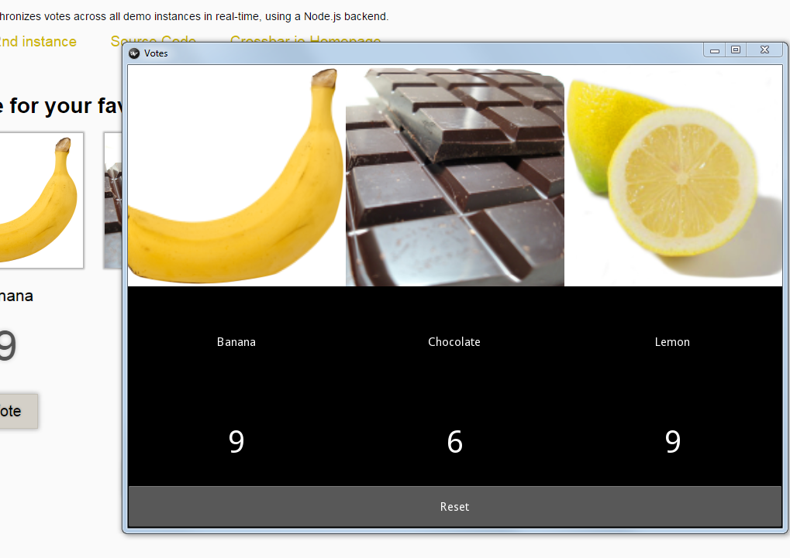

This version of the Votes demo offers a frontend written using [Kivy](http://kivy.org/#home), in addition to a browser frontend.



## Regular startup

In the demo folder do 

```
crossbar start
```

and then open 

```
http://localhost:8080
```

to see the browser frontend.

## Additional Requirements

For the kivy frontend you need to install kivy (big surprise) - follow the instructions at the [project website](http://kivy.org/docs/gettingstarted/installation.html).

You then need to install Autobahn|Python and its dependencies - for kivy:

In the `kivy` folder, using the Python as setup by kivy, do

* on Mac OSX

```
kivy -m pip install -r requirements.txt
```

* on other systems

```
python -m pip install -r requirements.txt
```

> Note: To use Python with kivy's setup e.g. on Windows go to the kivy folder, execute `kivy-X.x.bat` ( where `X.x` is the Python version you downloaded kivy for), which opens a command shell with the environment set to use the correct Python. Then navigate to the Votes demo folder and execute the above command.

Then start the kivy Votes frontend by doing

(Mac OSX)

``` 
kivy main.py
```

(others)

```
python main.py
```

This connects to the locally running Crossbar.io and backend, just like the browser frontend mentioned above.

Use either frontend to increase/reset the vote count, and see this updated immediately in the other frontend.

The code has proven to run as an Android app as well. Refer to [Create a package for Android](http://kivy.org/docs/guide/packaging-android.html) and [buildozer docs](http://buildozer.readthedocs.org/en/latest/) to find out how.

> Thanks to [Roger Erens](https://github.com/rogererens) for providing this example!
